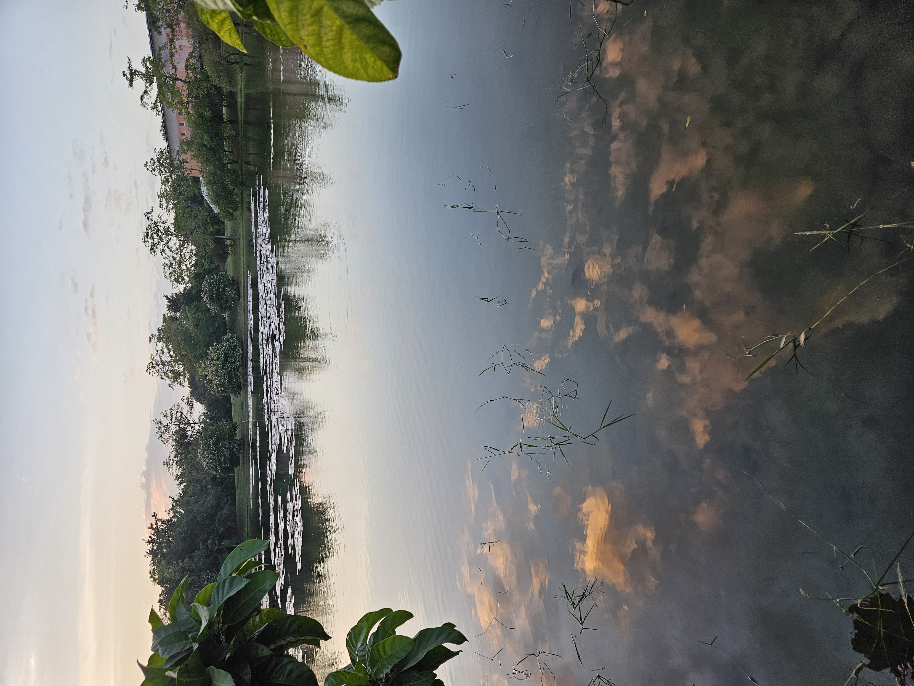

# 劉雨承
## 我笨笨的

* **煮飯**
* ~~威脅~~
* 統計學

*要求別人做的事 自己要先做得到*

[threads](https://www.threads.com)



> 名言
>> 一千個人眼中有一千個哈姆雷特

| 學習階段 | 學校名稱 |
| :------ | :------ |
| 國小 | 上館國小 |
| 國中 | 竹東國中 |
| 高中 | 香山高中 |
| 大學 |高雄科技大學|

``` python
print("Hello, Markdown!")
